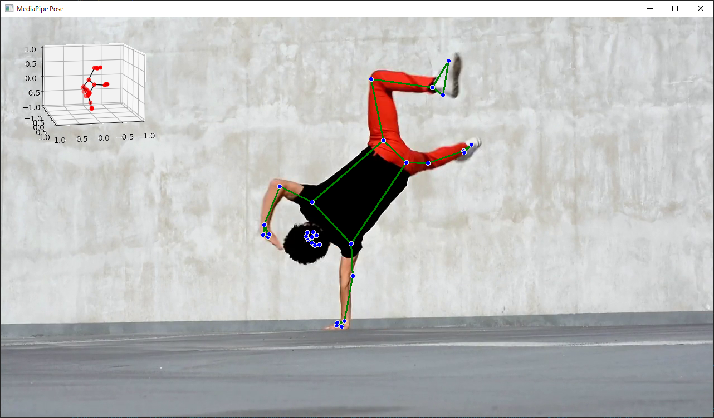

# Mediapipe Pose Sample

## Requirements

Python 3.7 or later is required.

## Setup

```bash
pip install -r requirements.txt
```

## Usage

```bash
usage: pose.py [-h] [--device DEVICE] [--width WIDTH] [--height HEIGHT] [--model_complexity MODEL_COMPLEXITY] [--plot_landmark]

optional arguments:
  -h, --help            show this help message and exit
  --device DEVICE       Camera device index or video file
  --width WIDTH         Camera width
  --height HEIGHT       Camera height
  --model_complexity MODEL_COMPLEXITY
                        model complexity (0:lite, 1:full(default), 2:heavy)
  --plot_landmark       plot 3d landmarks
```

```bash
# Camera Device
python pose.py --device 0 --width 640 --height 480 --model_complexity 1 --plot_landmark
```

```bash
# Video media file
python pose.py --device ./media/dance.mp4 --model_complexity 1 --plot_landmark
```


